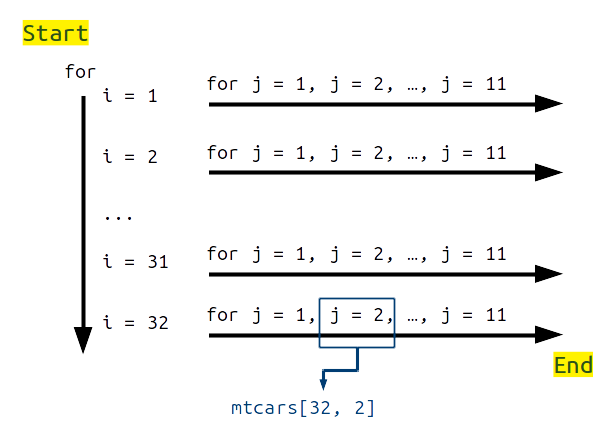

## What is a loop?

\begin{columns}
\begin{column}{0.5\textwidth}

\textbf{A loop repeats the same set of instructions (i.e., `code') across a particular set of conditions}
\newline
\pause
Suppose you want to print the following sequence:
\newline
$1$, $\frac{1}{2}$, $3$, $\frac{1}{4}$, $\dots$, $999$,  $\frac{1}{1000}$
\newline
\pause
How would you do it in R (without a loop)?
\pause
\end{column}
\begin{column}{0.5\textwidth} 
How would you explain what you want to do (verbally)?
\pause
\newline
\begin{enumerate}
  \item For each integer from 1 to 1000
  \item If the number is odd, print it
  \item If the number is even, divide by the number then print it
  \item Stop when when finished printing
\end{enumerate}
\end{column}
\end{columns}
## What is a loop?
\begin{columns}
\begin{column}{0.5\textwidth}
\textbf{A loop repeats the same set of instructions (i.e., `code') across a particular set of conditions}
\newline

Suppose you want to print the following sequence:
\newline

$1$, $\frac{1}{2}$, $3$, $\frac{1}{4}$, $\dots$, $999$,  $\frac{1}{1000}$
\newline


How would you do it in R (without a loop)?


\end{column}
\begin{column}{0.5\textwidth} 
How would you explain what you want to do (verbally)?
\newline
\begin{itemize}
  \item For $x = 1, 2, 3, ..., 999, 1000$ 
  \begin{itemize}
  \item Check if $x$ is even
  \item If $x$ is not even, then print $x$
  \item If $x$ is even, then print $1/x$
        \end{itemize}
  \item Stop when all $x$ values have been considered
  \newline
  \newline
\end{itemize}
\end{column}
\end{columns}


## Using a for loop in R


```{r, eval = FALSE}
for(x in 1:1000){         # The loop starts here
    
    
    
    # Do everything within these brackets, 
    #     in the order set by 1:1000
    #     i.e., for x = 1, then x = 2, 
    #     then x = 3, ..., then x = 1000
    
    # Finish the loop only after 'x' has
    #     substituted for each value
    
    
    
} # The loop ends here
```


## Using a for loop in R


```{r, eval = FALSE}
for(x in 1:1000){         # The loop starts here
    
    is_odd <- TRUE;       # First assume'x' is odd
    if(x %% 2 == 0){      # If 'x' is not odd
        is_odd <- FALSE;  # Set to false
    }                     # Now know if 'x' is odd
    
    if(is_odd == TRUE){   # If 'x' is odd,
        print(x);         # then print 'x'
    }else{                # Else it is even,
        print(1/x);       # so print 1/x
    }
} # The loop ends here
```


## Loops can be inside other loops

```{r, eval = FALSE}
data(mtcars) # Read in R table of data about cars
rows <- dim(mtcars)[1]; # Get total mtcars rows
cols <- dim(mtcars)[2]; # Get total mtcars columns
for(i in 1:rows){            # for each row
    for(j in 1:cols){        # for each column
        print(mtcars[i, j]); # print the value
    }
}
```


## Loops can be inside other loops




## While loops in R

**Same idea as a `for` loop, but different termination condition** \newline

```{r, eval = FALSE}
counter <- 200; # Set a counter outside the loop
while(counter > 0){ # Keep looping while counter > 0
    
    print(counter); 
    
    counter <- counter - 1; # Avoid infinite loop
    
} # The loop ends here
```


## Guided with with using_loop notes

- **Feel free now to work through the [guided notes](https://stirlingcodingclub.github.io/using_loops) on using loops, or to practice using loops with your own code** \newline

- **Notes include five practice problems, with suggested answers, to get started** \newline \newline \newline \newline \newline \newline \newline \newline

https://stirlingcodingclub.github.io/using_loops


## Practice problems {.smaller}

1. Using a `for` or `while` loop, print all of the numbers from 1 to 1000 that are multiples of 17

2. Using `data(nhtemp)`, write a loop to add up the temperatures *for all of the even numbered years*, then divide by the total number of even numbered years to get the average.

3. Using a `while` loop, calculate the sum of the series, $Y = \frac{4}{1} - \frac{4}{3} + \frac{4}{5} - \frac{4}{7} + \frac{4}{9} - \frac{4}{11} + \dots$ to at least 10000 terms. What does $Y$ appear to approach as more terms are added?

4. Write a while loop that keeps printing numbers sampled from $\mathcal{N}(0, 1)$, but stops after sampling a number > 1.

5. Create an $8 \times 8$ matrix `mat` with diagonal values of 1 and off-diagonal selected from $\mathcal{N}(0, 1)$. Swap elements `mat[i, j]` with `mat[j, i]` **only** if `mat[i, j] < mat[j, i]`

https://stirlingcodingclub.github.io/using_loops


